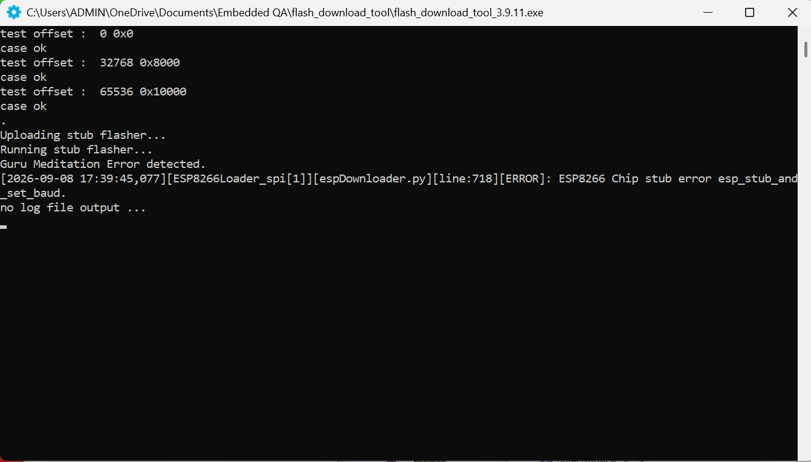
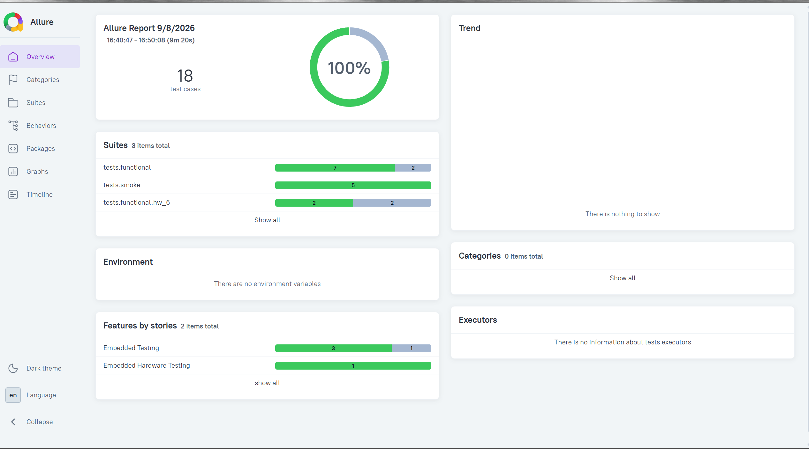
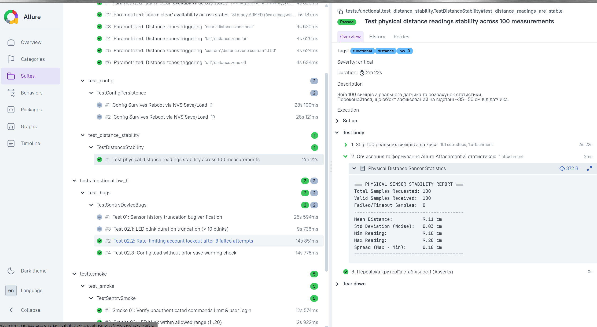

**Виріб:** SENTRY-C1 (fw_3)  
**Версія прошивки:** v0.9.3 (build 20260812)  
**HW revision:** rev. B 

PHYSICAL SENSOR STABILITY REPORT
|                         |         |
|-------------------------|---------|
|Total Samples Requested: | 100     |
|Valid Samples Received:  | 100     |
|Failed/Timeout Samples:  | 0       |
|Mean Distance:           |50.67 cm |
|Std Deviation (Noise):   |0.14 cm  |
|Min Reading:             |50.50 cm |
|Max Reading:             |50.90 cm |
|Spread (Max - Min):      |0.40 cm  |

